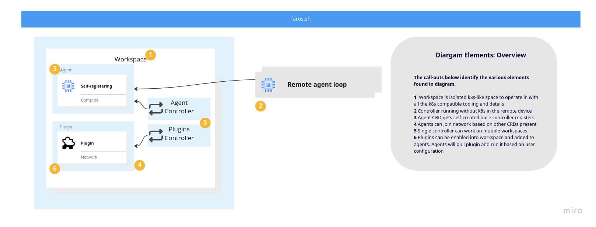

# Faros

Faros hub is Kubernetes native Edge device management control plane.
It allows to manage edge IoT devices in the way similar to Kubernetes.

Manage your devices, plugins and all the interactions using `kubectl` or any
`k8s` compatible tool.

Faros hub will enable you to connect remote device to central hub and deploy
plugins to them. Plugins are go-lang based application that can be used to
communicate with device and send data to central hub.

## Getting started

Start by installing Faros hub on your Kubernetes cluster.

```bash
TBC
```

Create first workspace and register your first device.

```bash
TBC
```

Once device registered you can deploy plugins to it.

## Plugins

Plugins are go binaries containing Kubernetes reconciler. Faros will distribute
plugins to edge devices and run them on the device with right context. At the same time
exposing Plugins API into workspaces, where plugins are enabled.

Plugins will be able to communicate with Faros hub and other plugins by interacting
with Kubernetes API.

Example for network plugin in your workspace:
```bash
apiVersion: plugins.faros.sh/v1alpha1
kind: Network
metadata:
  name: wireguard
spec:
  type: wireguard
  config:
    privateKey: "TBC"
    listenPort: 51820
    peers:
      - publicKey: "TBC"
        allowedIPs: ""
```

Example for docker plugin in your workspace:
```bash
apiVersion: plugins.faros.sh/v1alpha1
kind: ContainerRuntime
metadata:
  name: docker-runtime
spec:
  type: docker
  config: TBC
```

Configure your device to use wireguard network and docker runtime plugins.

```bash
apiVersion: edge.faros.sh/v1alpha1
kind: Agent
metadata:
  name: foo1
spec:
  plugins:
   - name: wireguard
     config: TBC
   - name: docker-runtime
     config: TBC
```

This will deploy wireguard network plugin to your device and configure it to use it.
At the same time it will deploy docker runtime plugin and configure it to use it.

You can write server and client side plugins. In example you can write plugin that
reconciles and run in your edge device, and server side plugin that will be able to
manage data coming from your device.

Each device reads agent `spec` and updates `status` accordingly.

Anybody can write plugins and publish to faros marketplace.



## Important

Project is in heavy development. It is not ready for production use.
Evolving architecture overview can be found here:
https://miro.com/app/board/o9J_lob-CMw=/?share_link_id=60410961009

## Getting started

Currently project still needs [`kubectl-kcp`](https://github.com/kcp-dev/kcp) to be installed. It will be replaced
by `kubectl-faros` in the future with opinionated configuration.

To use `kind` tooling you will need to have pre-requisites configured, See `docs/dev-kind.md` for more details.

Run Faros hub "all-in-one" configuration:

```bash
# create hosting kind cluster for tooling. This will install kcp, dex, cert-manager,
# and local reverse dialer proxy for local development.
make setup-kind
# in separate terminal run local process to interact with reverse dialer proxy
go run ./cmd/all-in-one
```

Create first workspace/virtual cluster:

```bash
# login to faros
go run ./cmd/kubectl-faros login
# create workspace
go run ./cmd/kubectl-faros workspace create test
# check if workspace is ready
go run ./cmd/kubectl-faros workspace get
```

Create first agent:

```bash
go run ./cmd/kubectl-faros agent generate agent1 -f agent1.kubeconfig
```

This will create `Registration` object in workspace and default namespace.
`Registration` object is used to register agent with hub. It is backed by `serviceAccount`,
`Role`, `RoleBinding` and `Secret` objects.

Same registration object can be used to register multiple agents.

Open new terminal and run agent with generated kubeconfig:

```bash
export KUBECONFIG=agent1.kubeconfig
go run ./cmd/edge-agent
```

In the first terminal you should see Agent reporting to hub:

```bash
kubectl get agent agent -o yaml
apiVersion: edge.faros.sh/v1alpha1
kind: Agent
metadata:
  annotations:
    kcp.dev/cluster: root:compute:clusters
  creationTimestamp: "2022-10-15T11:17:11Z"
  generation: 1
  name: agent
  namespace: default
  resourceVersion: "15018"
  uid: 18c9b323-dc48-4e67-81bd-aade4da83efa
spec: {}
status:
  conditions:
  - lastTransitionTime: "2022-10-15T12:06:39Z"
    status: "True"
    type: Ready
```

Add plugin to agent:
TODO: Add registration tokens who would carry automatic plugin metadata to be used.

```bash

```

# Roadmap

See [TODO](TODO.md) for more details.
